 

# BOOK|tagram

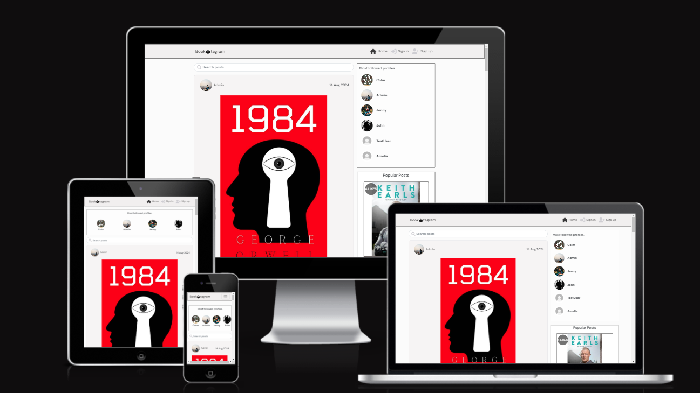
 
## Social website for all book enthusiasts. Show everyone what you are reading and post reviews of books you read for others to see. Follow other profiles, like and comment on people's posts!
 

<h1 id="contents">Contents</h1>

-   [Introduction](#introduction)
-   [Database Schema](#database-schema)
-   [User Stories](#user-stories)
-   [Agile Methodology](#agile-methodology)
-   [Scope](#the-scope)
-   [Design](#design)
-   [Features](#features)
    -   [Landing Page](#landing-page)
    -   [Navigation Bar](#navigation)
    -   [Side Bars](#side-bars)
-   [Technologies Used](#technologies-used)
    -   [Languages](#languages)
    -   [Frameworks, libraries, and Programs](#frameworks-libraries-and-programs)
-   [Testing Automated and Manual](TESTING.md)
-   [Bugs](#bugs)
-   [Project Setup](#project-setup)
-   [Deployment](#deployment)
-   [Credits](#credits)
-   [Acknowledgements](#acknowledgements)

## Introduction

BOOKtagram is a frontend React.js project that runs on Heroku.

This app allows users to view uploaded photos ....
Once registered, logged user can create, edit, add and delete posts, add, edit and delete comments and their own book reviews from the frontend.

A live version of the website can be found <a href="https://pp5front-c44116638555.herokuapp.com/" target="_blank">here.</a>

The backend API repository for BOOKtagram can be found <a href="https://github.com/madeleine2086/pp5-backend/" target="_blank">here.</a>

 

<h2 id="database-schema">Database Schema</h2>

<h2 id="user-stories">User Stories</h2>

* As a user, I can:
  - I can view navbar on every page so that I can easily navigate between pages
  - I can sign up and create an account so that I have access to features available only to registered users
  - I can see sign in and sign up options so that I can sign in or sign up if I'm not already
  - I can see users avatars so that I can identify users of the application
  - I can navigate through website easily so that I can see the content without refreshing the page
  - I can view details of a post so that I can see a photo and read the text
  - I can view list of posts starting with the newest so that I am up to date with the content
  - I can use keywords in a search bar so that I can find profiles and posts I want to view
  - I can scroll through content loaded automatically so that I don't have to click next page button
  - I can view comments on posts so that I know what other users think about the content
  - I can view other users profiles so that find out more about them an view their content
  - I can view statistics about another registered user, like bio, posts, followers etc. so that I can learn more about them
  - I can view a list of most followed profiles so that I see whose content is the most popular
 

* As a registered and logged in user, I can:
  -  I can sign in to my account so that I can access all functionalities available to authenticated users
  -  I can see my logged in status so that I can log in if I want to
  -  I can create a post so that other platform users can see it
  -  I can edit my post so that I can make corrections after the post was created
  -  I can like a post so that I can show post's author that I liked their content
  -  I can view posts liked by me so that I can go back to the content I enjoyed
  -  I can filter through posts and view only users I follow so that I know their newest content
  -  I can create, update and delete my comments so that share, update and remove any thoughts I want to review and have control over
  -  I can follow and unfollow a user so that I can decide what will be displayed in posts feed
  -  I can edit my profile so that I can update information about me or change my profile picture
  -  I can update my username and password so that I can keep my profile secure and change displayed name
  -  I can view other users reviews so that I can find out what they think about a product they're using
  -  I can create, edit and delete my own review so that I can have control over my content that other website users see.

    
 

<h2 id="agile-methodology">Agile Methodology</h2>

The Agile Methodology was used to plan this project, implemented through Github and the Project Board.
Project Board can be seen here => <a href="https://github.com/users/madeleine2086/projects/6" target="_blank">BOOKtagram User Stories</a>

<h2 id="the-scope">The Scope</h2>

* To provide users with good expierience when using a website
* To provide search functionality to find posts
* To provide role-based permissions that allows user to interact with the site
* To provide users with a visually pleasing site - intuitive to use and easy to navigate.

<h2 id="design">Design</h2>
<h3>Colours</h3>
  BOOK|tagram is designed to be simple and clean and modern looking, as the emphasis is on the content. High contrast, but not overwhelming, colours were used. 

<h3>Wireframes</h3>

<h2 id="features">Features</h2>

<h3 id="landing-page">Landing Page</h3>
    * The landing page is the home page of the website, visible first when the site loads. The landing page displays all posts in   chronological order by latest first and the sidebar displays the popular profiles. Below popular profiles there are Popular Posts (top liked posts) and Most Commented Posts (posts with the most comments).

    <h4>Landing page on desktop:</h4>
    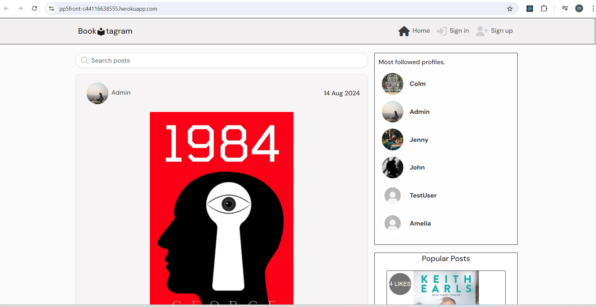
    <h4>Landing page on mobile:</h4>
    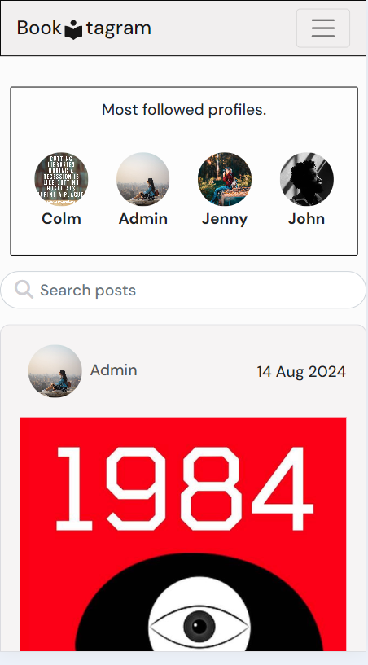

<h3 id="navigation">Navigation</h3>
    * Options in the navigation bar are changing depending on wheter a user is logged in or not. The navigation bar is placed on the top of each page, allowing access to the navigation at any time. This is consistant throughout the website.
    * Navigation menu options when a user is not logged in are home, login & sign-up.
    * Navigation menu options when an authenticated user is logged in are home, add post, feed, liked, sign out & profile.

    Navigation bar on desktop when not logged in:
  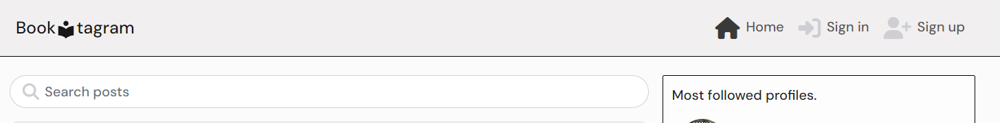

    Navigation bar on desktop when a user is logged in:
  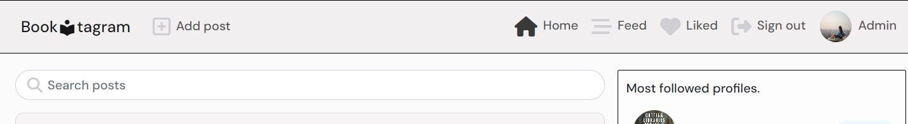

    Navigation bar on mobile when not logged in:
  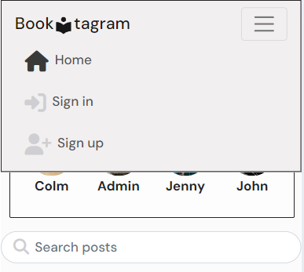

    Navigation bar on mobile when a user is logged in:
  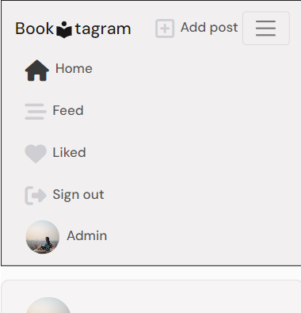

<h3 id="side-bars">Side Bars</h3>
    * There are three side bars (components) on the desktop view: Popular Profiles, Popular Posts and Most Commented Posts.
      *Popular Profiles on desktop:
      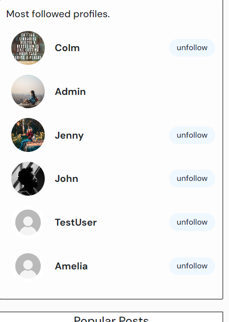
      *Popular Profiles on mobile:
      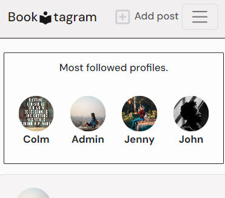

      *Popular Posts:
      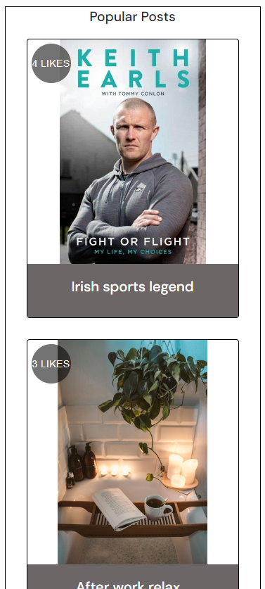

      *Most Commented Posts:
      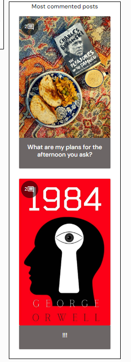

    * Most Commented Profiles and Popular Posts are disabled for a mobile view.

## Testing

## Bugs

## Technologies Used

<a href="#top">Back to the top.</a>

### Languages

- Python - Django REST API

### Frameworks, libraries, and Programs

## Deployment

<a href="#top">Back to the top.</a>
<h2 id="deployment">Deplyoment on Heroku</h2>
The project was deployed via Heroku. 

Before deploying to Heroku I created the Procfile with 'web: serve -s build'

Deployment steps:
- In Heroku create a new app, give it a name and choose location.
- In the deploy tab, go to 'deployment method', choose 'Github'
- Search for the repository in Github that you want to connect and click on the connect button
- In the 'manual deploy' section click on 'deploy branch'
- The build log will run, when complete you will see a message saying 'build succeeded'
- An 'Open App' button will appear, click this to take you to your deployed app.
- Optional you can enable automatic deploys in the 'deployment section' so each time you push your code to 'Github' your deployed app will be updated.

## Credits
<h2 id="credits">...</h2>
### Some photos used in the project are my own.
#### Other photos used are from:

## Acknowledgements

<a href="#top">Back to the top.</a>
<h2 id="acknowledgements">...</h2>

