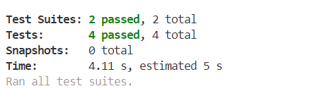

<h1>BOOK|tagram Testing</h1>

Back to the [README](README.md)

<h1 id="contents">Contents</h1>

-   [Manual Functional Testing](#manual-testing)
-   [Automated Jest Testing](#automated-testing)
-   [Alerts](#alerts)
-   [HTML Validator](#html-validation)
-   [CSS Validator](#css-validation)
-   [Console Results](#console-results)
-   [Lighthouse Results](#lighthouse)
    -   [Desktop](#lighthouse-desktop)
    -   [Mobile](#lighthouse-mobile)
-   [Bugs / Issues](#bugs)
 
<h1 id="manual-testing">Manual Functional Testing Results</h1>

- Manual tests were performed on:
    -   Navigation bar:
        -   All links are working
        -   Home, Sign In and Sign Up icons visible for not logged in user
        -   Home, Add Post, Like, Feed, Sign out and Profile icons visible for a logged in user
    -   Authentication system:
        -   Sign in link is working
        -   Sign up link is working and after successful registration redirects user to sign in page
    -   Landing page:
        -   Posts, search bar, Popular Profiles, Popular Posts and Most Commented Posts side bars are visible for all users
    -   Post:
        -   A post with its comments is vivible to all users
        -   A logged in user can add a post, edit a post and delete a post
    -   Review:
        -   A book review can be added to a post only if a user is logged in and is post's owner.
        -   A review can be edited or deleted by post's owner.
    -   Like:
        -   A logged in user can like a post and see all liked posts after clicking "Liked" icon in navigation bar
        -   A logged in user can unlike a post and that post is removed from "Liked" page
    -   Feed:
        -   A logged in user can follow a profile and see all followed profiles after clicking "Feed" icon in navigation bar
    -   Profile:
        -   A logged in user can see and edit their own profile, change password or username.
        -   A logged in user can access their profile by clicking a profile icon in navigation bar
        -   User profiles are visible for all users
    -   Comment:
        -   Any user can see comments on posts
        -   A logged in user can add a comment, edit and delete it

 
<h1 id="automated-testing">Automated Jest Testing Results</h1>
- Created 3 NavBar tests to see if the correct navigation links are shown to a logged in user versus a logged out user in the header.
-  1 NotFound test to see if the not found message is shown when no results can be found.

 
<h1 id="alerts">Alerts</h1>

<h2>Authentication</h2>

-   On the sign in and sign up page if a user submits a password that does not meet the requirments a warning alert will be displayed explaining the reason it failed.

-   Logged in success alert with username top right of the screen.

-   Logged out success alert top of the screen.

<h2>Posts</h2>

-   Success alert pops up when post is created, edited and deleted (after confirming deletion)

-   When the delete icon is clicked a confirmation modal pops up to confirm the action to prevent accidental deletions.

<h2>Comments</h2>

-   Success alert pops up when post is created, edited and deleted (after confirming deletion)

-   When the delete comment icon is clicked a confirmation modal pops up to confirm the action to prevent accidental deletions.

<h2>Likes</h2>

-   Success alert after like/unlike a post:

-   Message displayed to inform a user that they can't like their own post:

<h1 id="html-validation">HTML Validation</h1>

<h1 id="css-validation">CSS Validation</h1>

<h1 id="console-results">Console Results</h1>

<h2 id="console-loggedout">Logged Out</h2>

-   The browser console shows 3 errors related to authentication as is expected as the user is not logged in.

<h2 id="console-loggedin">Logged In</h2>

<h1 id="lightHouse">Lighthouse</h1>

<h2 id="lighthouse-desktop">Desktop</h2>

-   Performance could be improved on by adding lazy loading to the images and implementing a CDN with caching.

<h2 id="lighthouse-mobile">Mobile</h2>

 

<h1 id="bugs">Bugs / Issues</h1>

- There is a known issue with the DRF/Moments walkthrough which prevents mobile users from being able to log in unless they change their browser settings. Therefore it is fair to say that 'BOOK|tagram' will work on mobile as long as a user is not logged in. Adding posting, reviewing, commenting, following and liking won't be possible, however, a user can still view and see all the comments on posts.
The solution to this issue is to combine frontend and backend, so they are on the same URL, preventing cross tracking issues.
After consulting Oisin from tutoring and his confirmation that it is fine to leave the app with frontend and backend on separate URLs, I made the desicion not to combine the two.

- Disclaimer on npm Audit Issues:
As students, we're not expected to fix the following npm audit errors identified in this project. At the time of running npm audit, my application has 10 vulnerabilities (3 moderate and 7 high)

