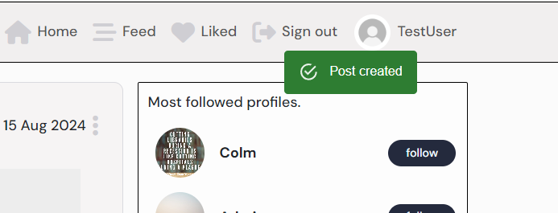

<h1>BOOK|tagram Testing</h1>

Back to the [README](README.md)

<h1 id="contents">Contents</h1>

-   [Manual Functional Testing](#manual-testing)
-   [Automated Jest Testing](#automated-testing)
-   [Alerts](#alerts)
-   [HTML Validator](#html-validation)
-   [CSS Validator](#css-validation)
-   [Console Results](#console-results)
-   [Lighthouse Results](#lighthouse)
    -   [Desktop](#lighthouse-desktop)
    -   [Mobile](#lighthouse-mobile)
-   [Bugs / Issues](#bugs)

<h1 id="manual-testing">Manual Functional Testing Results</h1>

 
<h1 id="automated-testing">Automated Jest Testing Results</h1>
 
<h1 id="alerts">Alerts</h1>

<h2>Authentication</h2>

-   On the sign in and sign up page if a user submits a password that does not meet the requirments a warning alert will be displayed explaining the reason it failed.

-   Logged in success alert with username top right of the screen.

-   Logged out success alert top of the screen.

<h2>Posts</h2>

-   Success alert pops up when post is created, edited and deleted (after confirming deletion)

-   When the delete icon is clicked a confirmation modal pops up to confirm the action to prevent accidental deletions.

<h2>Comments</h2>

-   Success alert pops up when post is created, edited and deleted (after confirming deletion)

-   When the delete comment icon is clicked a confirmation modal pops up to confirm the action to prevent accidental deletions.

<h2>Likes</h2>

-   Success alert after like/unlike a post:

-   Message displayed to inform a user that they can't like their own post:

<h1 id="html-validation">HTML Validation</h1>

<h1 id="css-validation">CSS Validation</h1>

<h1 id="console-results">Console Results</h1>

<h2 id="console-loggedout">Logged Out</h2>

-   The browser console shows 3 errors related to authentication as is expected as the user is not logged in.

<h2 id="console-loggedin">Logged In</h2>

<h1 id="lightHouse">Lighthouse</h1>

<h2 id="lighthouse-desktop">Desktop</h2>

-   Performance could be improved on by adding lazy loading to the images and implementing a CDN with caching.

<h2 id="lighthouse-mobile">Mobile</h2>

<h1 id="bugs">Bugs / Issues</h1>

